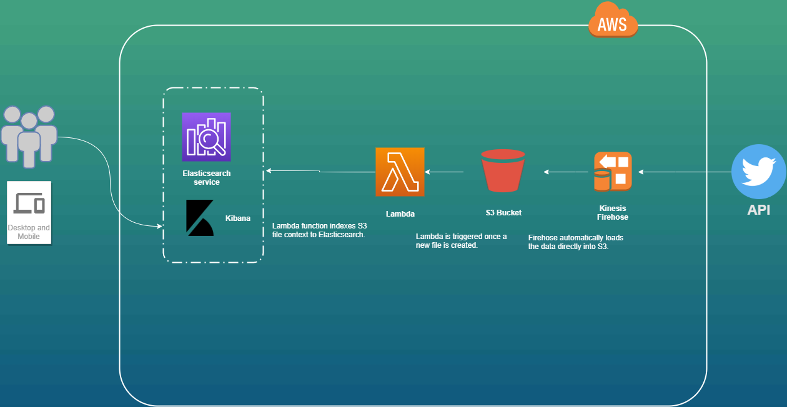

# TwyBoard
TwyBoard - A Near Real-Time Twitter Discovery Platform build with AWS

## AWS Architecture

This dashboard has the following architecture:

- A producer device (in this case, the Twitter feed) puts data into Amazon Kinesis Firehose.
- Firehose automatically buffers the data (in this case, 5MB size or 5 minutes interval, whichever condition is satisfied first) and delivers the data to Amazon S3.
- A Python Lambda function is triggered when a new file is created on S3 and indexes the S3 file content to Amazon Elasticsearch Service.
- The Kibana application runs on top of the Elasticsearch index to provide a visual display of the data.

